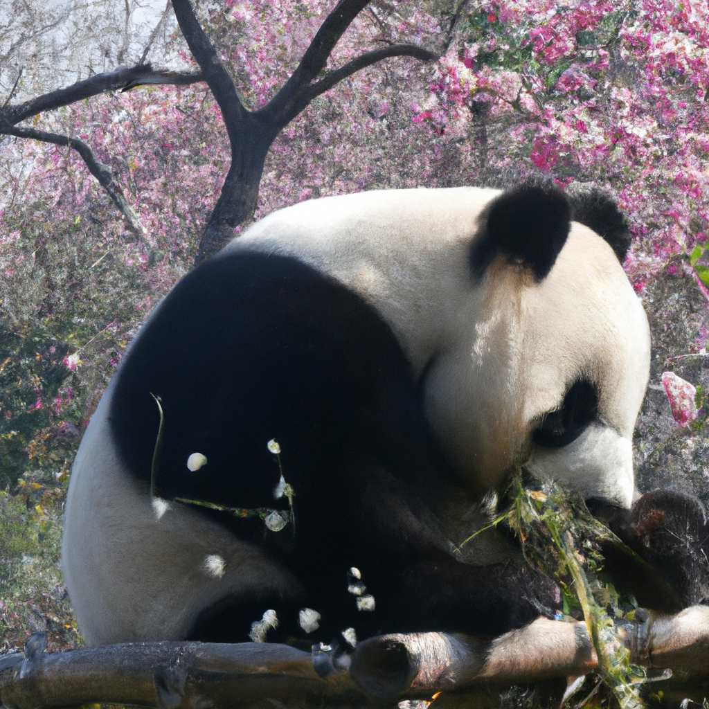

# DALL-E Text-to-Image Generator

A web application that generates images from text prompts using OpenAI's DALL-E API.

## Project Structure

DALL-E_Text-to-Image/ ├── generated_images/ # Folder containing generated images │ ├── example_image1.png # Example generated image 1 │ └── example_image2.png # Example generated image 2 ├── .env # Environment variables file ├── dalle_app.py # Streamlit application script ├── dalle_generate.py # Script for local testing ├── requirements.txt # Python dependencies └── README.md # Project documentation

## Example Generated Image

*Description: A panda eating bamboo under cherry blossoms.*

Features
	CLI Tool:

		Accepts prompts and resolution inputs directly from the terminal.
		Saves generated images in a structured folder (generated_images/) with descriptive file names.
	Web App:

		User-friendly interface built with Streamlit.
		Allows users to input prompts, choose resolutions, and view generated images instantly.
	Image Output:

		Generated images are saved in a centralized folder (generated_images/).

Requirements
1. Python Version: Python 3.7 or higher
2. Dependencies:
		streamlit
		openai
		requests
		pillow
Install all dependencies using:
	pip install -r requirements.txt

Setup
1. Clone the Repository
	git clone https://github.com/himanshu-dandle/dalle-text-to-image.git
	cd dalle-text-to-image
2. Create a Virtual Environment
	python -m venv env
	source env/bin/activate  # On Windows: .\env\Scripts\activate

3. Install Dependencies
	pip install -r requirements.txt
4. Add OpenAI API Key
	Replace "YOUR_API_KEY" in dalle_generate.py and dalle_app.py with your OpenAI API key.

Usage
Command-Line Tool
1.Run the CLI script:
	python dalle_generate.py
2. Enter the required prompt and resolution when prompted.
3. The generated image will be saved in the generated_images/ folder.

Web App
1.Start the Streamlit app:
		streamlit run dalle_app.py
2. Open the link provided by Streamlit (e.g., http://localhost:8501).
3. Enter your prompt and select a resolution to generate an image.

Output
All generated images are saved in the generated_images/ folder with the naming convention:

	<prompt_text>_<resolution>.png
	Example
		For the prompt "A futuristic city with flying cars" at 512x512 resolution:

		Saved as: generated_images/futuristic_city_with_flying_cars_512x512.png
		
Sample Prompts
	Nature: "A serene beach with a pink sunset and palm trees"
	Futuristic: "A futuristic cityscape with flying cars under neon lights"
	Abstract: "An abstract painting of a dreamscape with floating islands"

Deployment
Deploy on Streamlit Cloud
	Push the project to a GitHub repository.
	Deploy on Streamlit Cloud:
		1) Log in with GitHub.
		2) Select your repository and specify dalle_app.py as the main file.
		3)Share the generated public URL.
		
Future Enhancements
	1)Add batch image generation for multiple prompts.
	2)Explore additional resolutions or advanced image styles.
	3)Integrate Stable Diffusion or other open-source image generation models.
	
License
This project is open-source under the MIT License.

Acknowledgments
OpenAI for the DALL-E API
Streamlit for the web application framework
Inspired by similar projects in the community

